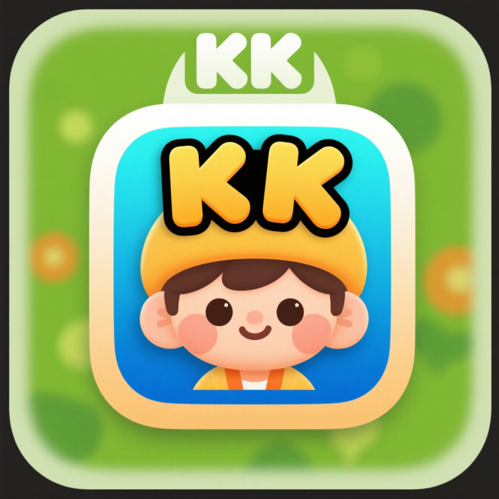

<div align="center">
  
  <h1>🎮 KK小游戏收纳盒</h1>
  <p><em>一个怀旧与乐趣并存的在线小游戏集合平台</em></p>
</div>

---

## 📌 项目简介

**KK小游戏收纳盒** 是一个集多款经典小游戏于一体的轻量级在线娱乐平台。用户可通过简洁美观的游戏大厅主页，快速浏览并进入自己喜欢的游戏，重温童年回忆或享受轻松休闲时光。

### ✨ 当前已集成游戏
- **坦克大战**：支持双人对战的经典射击游戏（✅ 已完成）
- **超级玛丽冒险**：跳跃闯关，拯救公主！
- **贪吃蛇大作战**：越吃越长，小心撞墙！
- **俄罗斯方块**：经典下落拼图，挑战极限速度
- **赛车竞速**：漂移、加速，争做赛道之王
- **飞机大战**：指尖空战，守护蓝天！

> 后续将持续添加更多趣味小游戏！

---

## 🗂 项目结构

```plaintext
KKsmallgame/
├── Home_Page/                 # 游戏大厅主页
│   ├── imgs/                  # 主页图标、背景等图片资源
│   └── static/                # 静态资源目录
│       ├── css/               # 样式文件（含响应式设计）
│       ├── js/                # 交互逻辑脚本
│       └── index.html         # 游戏大厅入口页面
├── Tank_Game/                 # 坦克大战游戏模块
│   ├── origin/                # 原始版本备份（可选）
│   └── static/                # 游戏专属资源
│       ├── css/
│       ├── js/
│       └── Tank.html          # 坦克大战游戏入口
└── README.md                  # 项目说明文档
```

---

## 🌟 功能亮点

- 📱 **响应式设计**：自适应桌面、平板与手机屏幕
- 🖥️ **多端适配**：部分游戏（如坦克大战）提供「桌面版」与「移动版」双控制方案
- 📐 **强制横屏（移动端）**：自动提示用户横屏，提升游戏沉浸感
- 🔍 **便捷导航**：卡片式游戏展示 + 支持关键词搜索
- 🎨 **简洁 UI**：清爽配色 + Font Awesome 图标库，提升视觉体验

---

## ▶️ 使用方法

1. **打开游戏大厅**  
   在浏览器中访问：  
   `Home_Page/static/index.html`

2. **浏览或搜索游戏**  
   点击游戏卡片查看简介，选择心仪游戏。

3. **开始游戏**  
   点击「开始游戏」按钮，若游戏支持多平台（如坦克大战），将提示选择 **桌面版（键盘控制）** 或 **移动版（触屏控制）**。

4. **享受乐趣！** 😄

---

## 🛠 技术栈

- **前端语言**：HTML + CSS3 + 原生 JavaScript（无框架依赖）
- **图标库**：Font Awesome
- **设计理念**：轻量、快速、零依赖、易扩展
- **兼容性**：现代主流浏览器（Chrome / Edge / Firefox / Safari）

---

## ⚠️ 注意事项

- 请确保文件路径与项目结构一致，避免资源加载失败（404 错误）。
- **移动端建议横屏游玩**，以获得最佳操作体验和画面比例。
- 部分游戏（如坦克大战、超级玛丽）依赖 **键盘输入**，推荐在 **桌面设备** 上游玩。
- 若需部署到服务器，请配置正确的静态资源 MIME 类型（尤其是 `.js` / `.css`）。

---

> 💡 **欢迎贡献**！如果你有想加入的经典小游戏，或发现任何 Bug，欢迎提交 Issue 或 Pull Request！